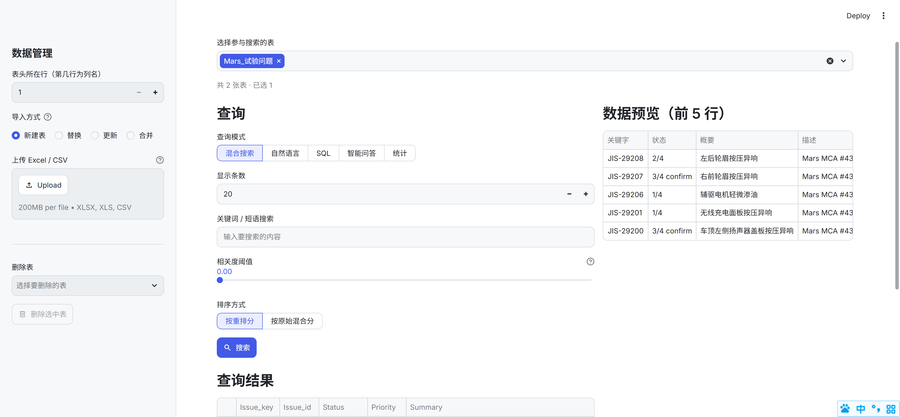

# 电子表格数据库（智能问答）

一个基于 **Streamlit** 的电子表格数据库应用：把 Excel / CSV 导入 SQLite，并支持关键词搜索、自然语言转 SQL、智能问答（RAG）和统计等多种查询方式。

## 功能特性

- **导入 Excel / CSV**：支持 `.xlsx` / `.xls` / `.csv`，可新建表、替换、按主键更新或合并。
- **混合搜索**：BM25 关键词 + 向量相似度双路检索，RRF 融合后交叉编码器重排，支持相关度阈值筛选。
- **自然语言查询（NL2SQL）**：用自然语言提问，自动生成并执行 SQL。
- **手写 SQL**：直接执行任意 SQL 语句。
- **智能问答（RAG）**：基于数据库内容用大模型回答，可选「代码解释器」进行数据计算。
- **统计**：一键查看表的行数、列数、列类型分布及各列统计。
- **结果导出**：查询结果可下载为 CSV，点击行可查看完整详情。

## 环境要求

- Python 3.9+
- 一个可用的 [SiliconFlow](https://siliconflow.cn) API Key（用于向量化、重排和大模型推理）

## 安装方法

### 1. 克隆 / 获取代码

```bash
git clone https://github.com/szlhfgd/Excel_database.git
cd Excel_database
```



### 2. 创建虚拟环境并安装依赖

```bash
# Windows
python -m venv .venv
.venv\Scripts\activate

# macOS / Linux
python3 -m venv .venv
source .venv/bin/activate
```

安装依赖：

```bash
pip install -r requirements.txt
```

### 3. 配置环境变量

在项目根目录创建 `.env` 文件（参考 `.env` 示例），填入你的 API Key：

```ini
# 必填：SiliconFlow API Key
SILICONFLOW_API_KEY=sk-xxxxxxxxxxxxxxxx

# 可选：默认即可，一般无需修改
SILICONFLOW_BASE_URL=https://api.siliconflow.cn/v1
EMBED_MODEL=BAAI/bge-m3
RERANK_MODEL=BAAI/bge-reranker-v2-m3
NL2SQL_MODEL=deepseek-ai/DeepSeek-V3
RAG_MODEL=deepseek-ai/DeepSeek-V3
CODE_MODEL=deepseek-ai/DeepSeek-V3

# 可选：向量化单条文本的最大字符数（防止超长单元格报错，默认 4000）
EMBED_MAX_CHARS=4000

# 可选：数据库文件路径（默认 spreadsheet.db）
SPREADSHEET_DB=spreadsheet.db
```

> **注意**：`SILICONFLOW_API_KEY` 是必填项，没有它无法进行向量化、重排和大模型问答。

## 使用方法

### 启动应用

```bash
streamlit run app.py
```

浏览器会自动打开 `http://localhost:8501`。

> **提示**：修改代码后需重启进程才能生效（终端 `Ctrl+C` 停止，再重新运行 `streamlit run app.py`）。

### 1. 导入数据

**作用**：把 Excel / CSV 文件导入 SQLite，作为后续查询的数据源。导入时会自动建表、写入数据，并为每一行生成向量用于语义检索。

在左侧边栏「数据管理」中操作：

1. **设置「表头所在行」**（默认第 1 行为列名）。若你的文件第 1 行是标题而非列名，可调整此值。
2. **选择「导入方式」**：
   - **新建表**：全新创建一张表。若同名表已存在会报错，需换名或改用其他方式。
   - **替换**：整表覆盖，删除旧表后重建。
   - **更新**：按「主键列」更新已有行，并删除新文件中已不存在的行（同步差异）。
   - **合并**：按「主键列」更新已有行，但保留原表中新文件没有的行。
   - 选择「更新 / 合并」时，需在「主键列」下拉框指定用于匹配的唯一列。
3. **上传文件**（`.xlsx` / `.xls` / `.csv`），等待进度条走完即导入完成。

> 导入完成后，表会自动出现在页面顶部的「选择参与搜索的表」中。

### 2. 选择要查询的表

**作用**：指定本次查询作用在哪些表上。可勾选一张或多张表，多表时会合并检索。

在页面顶部「选择参与搜索的表」中勾选即可。右侧会**按表分别**实时预览每个所选表的前 5 行数据，方便确认。

### 3. 选择查询模式

**作用**：页面左侧提供 5 种查询模式，分别适用于不同的查询需求。切换模式后，下方会显示对应的输入控件。

| 模式       | 适用场景                             |
| -------- | -------------------------------- |
| **混合搜索** | 输入关键词 / 短语，返回最相关的行（适合“找记录”）。     |
| **自然语言** | 用自然语言提问，自动生成并执行 SQL（适合“算数据”）。    |
| **SQL**  | 手写 SQL 直接执行（适合熟悉 SQL 的精确查询）。     |
| **智能问答** | 基于数据库内容用大模型回答（适合“问结论 / 总结”）。     |
| **统计**   | 一键查看表的行数、列数、列类型分布及各列统计（适合“看概况”）。 |

#### 混合搜索

**作用**：融合「关键词匹配（BM25 + 中文分词）」与「语义相似度（向量）」双路检索，再用 RRF 融合、交叉编码器重排，返回与输入最相关的数据行。

**使用方法**：

1. 在「关键词 / 短语搜索」输入框填写关键词或短语（可多个词）。
2. 拖动「相关度阈值」滑块（0~1）过滤低相关结果；设为 0 表示不过滤。
3. 选择「排序方式」：**按重排分**（默认，更准）或 **按原始混合分**（更快）。
4. 设置「最少返回条数」（默认 5）：即使阈值调高，也至少返回这么多条结果（受「显示条数」上限约束）；设为 0 表示不限制。
5. 设置「显示条数」（默认 20），点击「搜索」。

**结果说明**：

- 每行结果都带有「相关度」列（已归一化到 0~1，与「相关度阈值」滑块同一量纲），可直接对比判断某行为何被保留或过滤。
- 多表检索时，结果会**按来源表分组**展示（每组一个「表格：<表名>」标题），并各自提供独立的「下载 CSV」按钮；空行会自动隐藏。

**示例**：假设已导入一张「销售记录」表（含 客户、部门、金额、日期 等列）。在「关键词 / 短语搜索」输入“华东 大额 客户”，相关度阈值设为 0.3，显示条数设为 10，点击「搜索」，即可返回与“华东地区大额客户”语义最相关的记录行。

#### 自然语言（NL2SQL）

**作用**：把自然语言问题自动翻译成 SQL 并执行，无需手写 SQL。适合“金额大于 100 的记录”“按部门统计数量”这类问题。

**使用方法**：

1. 在「用自然语言提问」输入框输入问题（如“找出金额大于 100 的记录”）。
2. 点击「提问」。系统会生成 SQL 并执行，生成出的 SQL 会显示在结果上方，便于核对。

**示例**：在「用自然语言提问」输入“统计各部门的销售总额，按金额从高到低排序”，点击「提问」。系统会自动生成类似 `SELECT 部门, SUM(金额) AS 总额 FROM 销售记录 GROUP BY 部门 ORDER BY 总额 DESC` 的 SQL 并执行，结果以表格展示。

#### SQL

**作用**：直接执行手写 SQL 语句，适合精确、复杂的查询。

**使用方法**：

1. 在「手写 SQL」输入框输入 SQL（如 `SELECT * FROM 表名 WHERE 金额 > 100`）。
2. 点击「执行」，结果以表格展示。

**示例**：在「手写 SQL」输入 `SELECT 客户, 金额 FROM 销售记录 WHERE 金额 > 10000 ORDER BY 金额 DESC LIMIT 5`，点击「执行」，即可查看金额最大的前 5 条记录。

#### 智能问答（RAG）

**作用**：基于所选表的内容，用大模型回答自然语言问题。系统会先检索相关行作为上下文，再让模型据此回答，避免凭空编造。

**使用方法**：

1. 在「用自然语言提问（基于数据库内容回答）」输入框输入问题。
2. 设置「显示条数」（默认 5，即最多引用 5 行作为上下文）。
3. 可选「启用代码解释器」：开启后，模型可生成并执行 Python 代码对检索到的数据进行计算（如求和、均值、分组），并显示「生成的计算代码」与「代码执行结果」。
4. 点击「问答」，回答显示在结果区。

**来源标注**：回答会附带引用来源并**细化到具体行**，格式如「数据库表格：销售记录（行 3、7、12）、客户表（行 5）」，便于核对模型依据；若启用代码解释器，还会附上「【来源：…】」标注。

**示例**：在「用自然语言提问（基于数据库内容回答）」输入“华东地区哪个客户的累计下单金额最高？”，显示条数设为 5，点击「问答」。系统会检索相关记录作为上下文，回答“华东地区累计下单金额最高的是 XX 客户，累计金额为 XXXX 元”。若开启「启用代码解释器」，还可问“按部门计算平均金额并列出前三名”，系统会生成并执行 Python 代码完成计算。

#### 统计

**作用**：快速查看所选表的整体概况，无需写任何查询。

**使用方法**：点击「统计」，即可看到总行数、列数、数值列数等指标，以及列类型分布图和各列的统计信息（均值、最值、缺失数等）。

**示例**：选中「销售记录」表后点击「统计」，可看到该表共有 N 行、M 列，其中「金额」为数值列（均值、最大值、最小值），「部门」「客户」为文本列，并展示各列类型分布图，快速了解数据概况。

### 4. 查看结果

**作用**：查看并导出查询结果。

- 查询结果以表格展示；**点击某行**可查看该行完整 JSON 详情。
- 点击「下载 CSV」可将当前结果导出为 CSV 文件；在混合搜索等多表场景下，结果按来源表分组，每组提供独立的「下载 CSV」按钮。

## 常见问题

**Q：导入时报错 `Error code: 400 - code 20015`？**
A：通常是单条文本过长超过了模型 token 上限。应用默认会把每条文本截断到 `EMBED_MAX_CHARS`（4000）字符。若仍报错，请确认已重启应用（`Ctrl+C` 后重新 `streamlit run app.py`）以加载最新代码。

**Q：修改代码后界面没变化？**
A：Streamlit 需要重启进程才能加载新的 Python 代码。在终端按 `Ctrl+C` 停止，再重新运行 `streamlit run app.py`。

**Q：如何更换数据库文件？**
A：在 `.env` 中设置 `SPREADSHEET_DB` 指向新的 `.db` 文件路径。

## 项目结构

```
Excel_database/
├── app.py          # Streamlit 主应用（仅 UI 层，调用 src.services）
├── eval.py         # 问答评测工具（导入 src.services.queries）
├── src/
│   ├── services/   # 业务编排层（混合搜索、NL2SQL、RAG、统计、导入、检索）
│   │   ├── queries.py    # 查询/分析编排（无 st.* 依赖）
│   │   ├── ingest.py     # 文件导入与向量化
│   │   └── search.py     # 混合检索（BM25 + 向量 + RRF 融合）
│   ├── data/       # 数据访问层
│   │   └── db.py         # SQLite + 向量表（建表、读写）
│   └── ai/         # 模型与外部能力层
│       ├── llm.py        # 大模型调用（向量化、重排、NL2SQL、RAG 回答）
│       ├── code_exec.py   # 代码解释器沙箱
│       ├── websearch.py   # 网络搜索兜底
│       └── execute_sql.py # 只读 SQL 校验
├── 启动.cmd        # Windows 一键启动脚本
├── requirements.txt
├── .gitignore      # 忽略 .env / *.db / .venv 等
├── AGENTS.md       # 项目说明（供 AI 代理）
├── CONTEXT.md      # 领域上下文
├── docs/           # ADR 等文档
├── specs/          # 规格说明
├── .scratch/       # 本地工作区（问题跟踪）
└── tests/          # pytest 测试
```

## 运行测试

```bash
pytest
```

## 技术栈

- **Streamlit** — Web 界面
- **SQLite + sqlite-vec** — 数据存储与向量检索
- **rank-bm25 + jieba** — 关键词检索与中文分词
- **OpenAI SDK（SiliconFlow）** — 向量化 / 重排 / 大模型推理
